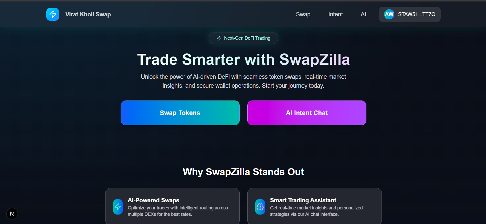
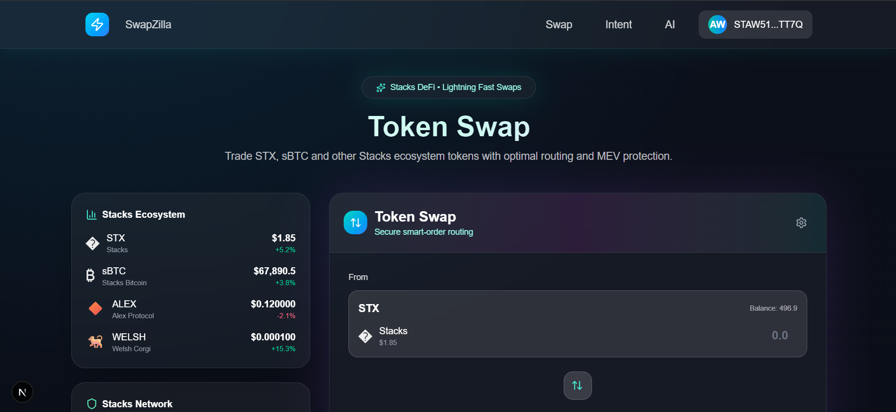

# ViratkholiSwap 🚀

**ViratkholiSwap** is a cutting-edge DeFi platform built on the Stacks blockchain, offering a seamless token swap mechanism, AI-powered intent-based trading, and NFT minting capabilities. Designed for efficiency and user-friendliness, it empowers users to trade tokens, mint NFTs, and execute secure multi-signature transactions with ease.

## 📖 Overview

ViratkholiSwap combines advanced blockchain technology with AI-driven features to deliver a robust decentralized finance experience. Key features include token swaps, NFT minting, and intent-based trading powered by natural language processing.

## 🛠️ Tech Stack

- **Frontend**: Next.js (v14 with App Router), React, TypeScript, Tailwind CSS
- **Blockchain**: Stacks blockchain, Clarity smart contracts, Stacks.js
- **Wallet Integration**: Leather Wallet
- **AI**: Natural language processing for intent-based trading
- **Development Tools**: Clarinet, ESLint, Prettier
- **API**: Stacks Testnet RPC (`https://api.testnet.hiro.so`)

## 📦 Setup Instructions

### Prerequisites
- Node.js (v18 or higher)
- npm or yarn
- Leather Wallet (for Stacks blockchain interaction)

### Installation Steps
1. **Clone the Repository**:
   ```bash
   git clone https://github.com/krnkiran22/SwapNil.git
   cd SwapNil
   ```

2. **Install Dependencies**:
   ```bash
   npm install
   ```

3. **Start the Development Server**:
   ```bash
   npm run dev
   ```

4. **Access the App**:
   Open your browser and navigate to [http://localhost:3000](http://localhost:3000).

## 📜 Smart Contract Addresses (Stacks Testnet)

### NFT Minting Contract
- **Address**: `ST1PQHQKV0RJXZFY1DGX8MNSNYVE3VGZJSRTPGZGM`
- **Name**: `nft-mint`
- **Features**:
  - SIP-009 compliant NFT minting
  - Supports owner (free) and public (1 STX) minting
  - Metadata with name, description, image, and rarity
  - Max supply: 10,000 NFTs

### Token Swap Contract
- **Address**: `ST2ZGZXG4030P1RNEAYP2NTP6JYETW4V634A2G608`
- **Name**: `swap-contract`
- **Features**:
  - Multi-token swaps (STX, BTC, and more)
  - Real-time price quotes
  - Liquidity pool management
  - Slippage protection

### Multi-Signature Transaction Manager
- **Address**: `ST1PQHQKV0RJXZFY1DGX8MNSNYVE3VGZJSRTPGZGM`
- **Name**: `multisig-manager`
- **Features**:
  - Batch transaction execution
  - Multi-signature validation
  - Gas-optimized transaction bundling

## 🚀 How to Use the Project

### 1. Token Swap
- Connect your Leather Wallet.
- Navigate to the **Swap** page.
- Select input and output tokens (e.g., STX → BTC).
- Enter the amount and confirm the transaction.

### 2. AI Intent-Based Trading
- Access the **AI Agent** interface.
- Enter natural language commands like:
  - "Swap 2 STX to BTC"
  - "Buy 0.1 BTC with STX"
  - "Exchange 500 STX for maximum BTC"
- The AI processes the command and executes the trade automatically.

### 3. NFT Minting
- Go to the **NFT** page.
- Enter metadata (name, description, image, rarity).
- Choose **Owner Mint** (free) or **Public Mint** (1 STX fee).
- Confirm the transaction via Leather Wallet.

### 4. Multi-Signature Transactions
- Prepare multiple transactions in the **Multi-Sig** interface.
- Bundle them for execution in a single transaction.
- Confirm with your wallet to save gas fees.

## 👥 Team Members
- **Kiran R** - Lead Developer, Smart Contract & Frontend
- **Abishake T** - AI Integration, UI/UX Design

## 📸 Screenshots

### Dashboard

Batch transaction management.

### Swap Interface

Clean and intuitive token swapping UI.

### AI Agent

Natural language command input for trading.

*Demo Video*: [Watch the demo on YouTube](https://youtu.be/xZVSWm_ZnHY) 

## 🗂️ Project Structure
```
SwapNil/
├── app/                    # Next.js app directory
│   ├── components/         # Reusable UI components
│   ├── swap/              # Swap interface pages
│   ├── nft/               # NFT minting pages
│   └── intent/            # AI agent interface
├── src/
│   ├── contracts/         # Smart contract interactions
│   └── components/        # React components
└── contracts/             # Clarity smart contracts
```

## 🤝 Contributing
1. Fork the repository.
2. Create a feature branch: `git checkout -b feature/amazing-feature`
3. Commit changes: `git commit -m 'Add amazing feature'`
4. Push to the branch: `git push origin feature/amazing-feature`
5. Open a Pull Request.

## 📄 License
This project is licensed under the MIT License. See the [LICENSE](LICENSE) file for details.

## 🔗 Resources
- **Live Demo**: [ViratkholiSwap App](https://viratkholiswap.vercel.app)
- **GitHub**: [https://github.com/krnkiran22/SwapNil](https://github.com/krnkiran22/SwapNil)
- **Project backend**: [View Contracts](https://github.com/krnkiran22/stacks_swap)

## 🆘 Support
- Create an issue on [GitHub](https://github.com/krnkiran22/SwapNil/issues).

---

**ViratkholiSwap** - Empowering DeFi with AI-driven trading and NFT minting on the Stacks blockchain. 🚀